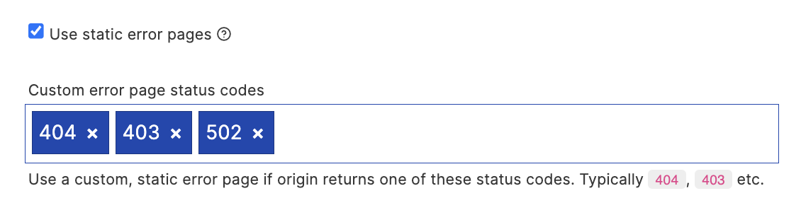

Custom error pages are easy to manage in Quant, whether in traditional CDN or static delivery modes.

Note: The content of error pages may be cached for up to 5 minutes. Please allow time for changes to display.

## Custom error pages (CDN / Proxy mode)

In your Page Rule responsible for proxying content enable the "Use static error pages" option, and provide a list of status codes you wish to enable custom error pages for.

For each of the status codes, you can provide custom page content as per the instructions below for static / Jamstack error pages.

These pages should be saved to a route in the format: `_quant[STATUS_CODE]`, for example:
* 404: `_quant404`
* 403: `_quant403`
* 502: `_quant502`

## Custom 404 error pages (static / Jamstack)

Custom error pages are easy with Quant. Any content pushed to QuantCDN with the special `/_quant404` route will become the active 404 page.

### Create via the Quant Dashboard

You can create custom 404 content directly via the Quant Dashboard using the [WYSIWYG or Code editors](/docs/dashboard/content#editing-or-creating-new-content). Remember to save under the special `_quant404` route.

### WordPress

1. Set the 404 page in QuantCDN settings (Settings > QuantCDN) - for example `/path/to/404-page`.
2. Ensure the 404 page is pushed into Quant (Batches > Custom routes and 404 page)
3. From now on any change to the 404 page content will automatically update the 404 error page in QuantCDN

### Drupal

1. Ensure the 404 configuration is set in Drupal (Configuration > Site Information > Default 404 page)
2. When the node is updated or a seed takes places the 404 page will be updated

### Static Generators

Ensure you have content under the `/_quant404` path (for example, `/_quant404/index.html`) before running `quant deploy`.

## Custom WAF error pages

WAF error pages can be controlled in the same way as the static / Jamstack approach. The following error pages are supported:

* `_quant_waf_403`: Override the default WAF block (403 Status) error page
* `_quant_waf_429`: Override the default rate limiting (429 Status) error page
