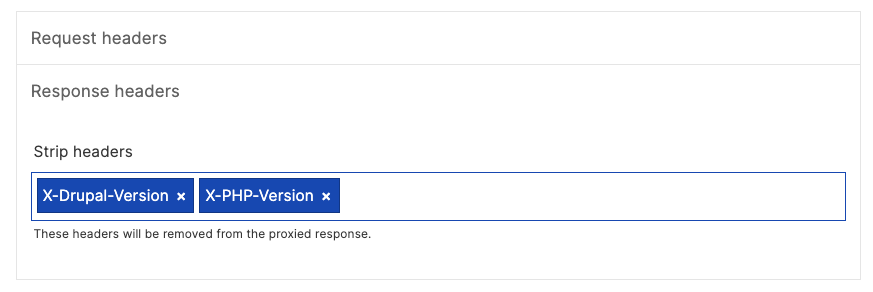

Proxy rules can be configured to route traffic back to your origin server(s) while maintaining a cache in our edge content delivery network.

This is effectively a traditional CDN, however there are many additional options available such as static failover, header overrides, alert injection, image optimization, and web-application firewall.

## Configuration overview

* **Proxy address**: is your backend/origin server. This may be a FQDN or IP address and should include the protocol.
* **Host header**: should be a valid Host header to send to the origin server.
* **Basic authentication**: provide a username and password if the origin server is protected by basic authentication.
* **Cache lifetime**: optionally override the cache lifetime of the proxied response in Quant. Leave blank to inherit the cache headers sent by your backend server.
* **Disable TLS verification**: may be used if the server is using a self-signed (or other invalid) certificate.
* **Only on 404**: will serve from the Quant static edge if content exists, else proxy.
* **Failover mode**: will serve from the Quant static offload only if the origin server shows sign of duress, or returns an unexpected response. [More detail below](#failover-mode).
* **Include injected alert**: allows you to alter the markup response and include the [sitewide alert banner](./alerts). This can be useful to allow widespread alert messaging to be presented to end users without the need for application-level change.

You may use the wildcard captures in your proxies, simply include a capture value in the proxy address. For example: a match on `/api/*` with a proxy address: `https://api.example.com/v1/$1`.

## Failover mode

When failover mode is enabled Quant is configured as a static failover service. In this mode, requests will be proxied back to your origin server unless signs of distress are detected.

For example, if your origin server takes more than 10 seconds to return a response, or returns an unexpected status code.

In this mode you may receive notifications when a failover mode is triggered. You may also specify a failover cache lifetime, which will ensure traffic is kept away from your origin server for a defined period.

## Request headers

You may optionally inject extra request headers to your origin server. This is useful to provide an extra layer of security, e.g: pass a shared key back to your origin server to protect direct origin server access.

You may also optionally strip response headers. This is useful to exclude certain origin headers from the response sent back to your end users. For example, this may be useful for excluding headers that contain mention of versions of software running on your origin server to improve security posture.

