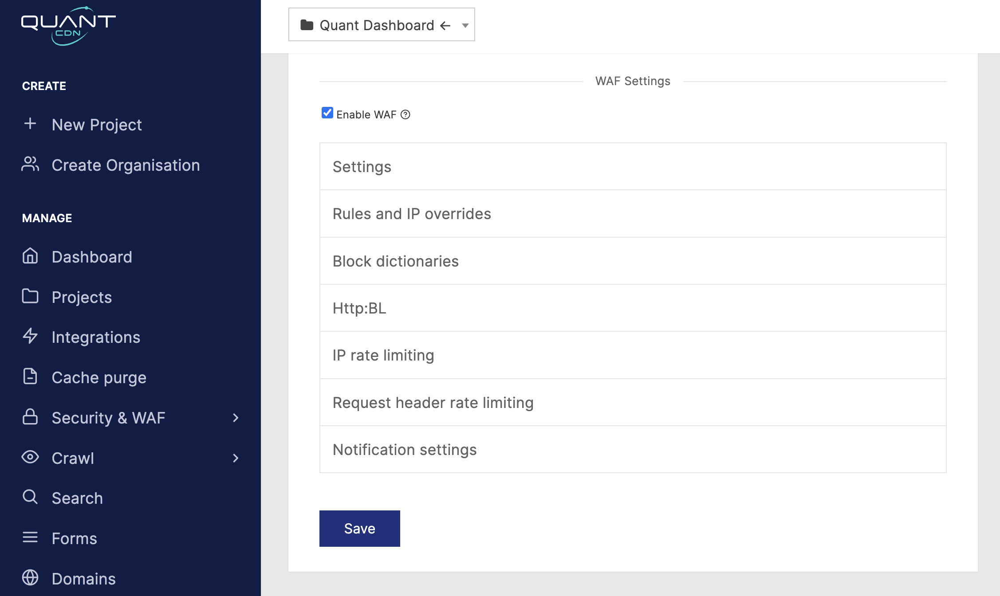

QuantCDN WAF is an optional extra that needs to be enabled for your account. To begin you will need to [contact support](https://support.quantcdn.io) and request WAF enablement for your organisation.

A WAF's aim is to protect dynamic systems from potentially harmful traffic patterns.

## Enabling WAF for your application

:::tip
When first enabling the WAF it is recommended to set the WAF in **report** mode. This will allow you to analyze traffic patterns and formulate a ruleset that will not impact your legitimate traffic.
:::

Once your account has WAF enabled you can utilise the [rules](https://dashboard.quantcdn.io/rules) page to add WAF and configure WAF to a proxy rule.

To add a rule:
1. Navigate to [rules](https://dashboard.quantcdn.io/rules)
2. Create or edit a **proxy rule**
3. Scroll down to *WAF settings* and check the **Enable WAF**

### Configuration settings

#### Settings

General settings for the WAF.

| Setting   | Default | Description                                        |
| --------- | ------- | -------------------------------------------------- |
| WAF Mode  | Block   | The opeating mode of the WAF                       |
| WAF Level | 1       | How strict the WAF will be when analyising traffic |

#### Rules and IP overrides

| Setting                     | Default | Description                                                                                        |
| --------------------------- | ------- | -------------------------------------------------------------------------------------------------- |
| Always skip WAF rule        |         | Remove specific rules from your WAF configuration and is used to tune the WAF for your application |
| Always allow from IPs       |         | An IP allowlist that will be excluded from WAF analysis                                            |
| Never allow from IPs        |         | A IP blocklist that will always be rejected by the WAF                                             |
| Never allow from user agent |         | User agent blocklist                                                                               |
| Never allow from referer    |         | HTTP referer blocklist                                                                             |

#### Block dictionaries

A dictionary of well-known bad actors that can be optionally enabled.

| Setting            | Default | Description                  |
| ------------------ | ------- | ---------------------------- |
| Block bad bots     |         | Enable the bot blocklist     |
| Block bad referers |         | Enable the referer blocklist |
| Block bad IPs      |         | Enable the IP blocklist      |

#### HTTP:BL

Enable [Project Honeypot](https://www.projecthoneypot.org/httpbl.php) integration for the WAF

| Setting              | Default | Description                                                        |
| -------------------- | ------- | ------------------------------------------------------------------ |
| Enable Http:BL       |         | Enable project honeypot                                            |
| Block suspicious IPs |         | Block IPs that project honeypot determines as suspicious           |
| Block harvester IPs  |         | Block any request that is determined to come from a data harvester |
| Block spam IPs       |         | Block spam IPs                                                     |
| Block search engines |         | Block requests that are marked as coming from search engines |

#### IP rate limiting

To better protect your application, the WAF can be configured to provide rate limits to request IPs. The rate limiting protects against burst IP traffic, the request rate needs to be sustained over a short period to trigger.

:::tip
When configuring the rate limit ensure to factor in asset requests — if you're average page load includes 200 assets this needs to be included as the rate limit is per proxy hit not per page view.
:::

| Setting         | Default  | Description                                                        |
| --------------- | -------- | ------------------------------------------------------------------ |
| Mode            | Disbaled | If the rate limit is applied                                       |
| RPS threshold   | 10       | The number of requests that are required to trigger the rate limit |
| Cooldown period | 30       | Number of seconds a client's IP address will be restricted |

When the rate limit is reached the WAF will respond with a 429 status code.

#### Request header rate limiting

| Setting         | Default  | Description                                                            |
| --------------- | -------- | ---------------------------------------------------------------------- |
| Mode            | Disabled | If the header rate limiting is enabled                                 |
| Header name     |          | The name of the header used to group requests and apply the            |
| RPS Threshold   | 5        | The number of requests per second a client needs to make in the window |
| Cooldown period | 30       | Number of seconds a blocked client will be restricted for |

#### Notification settings

QuantWAF can trigger notifications to a nominated Slack channel when a block or rate limit rule is triggered.

| Setting             | Default | Description                                           |
| ------------------- | ------- | ----------------------------------------------------- |
| Slack webhook       |         | Your applications webhook from Slack                  |
| Slack RPM threshold |         | Control the frequency of notifications to the webhook |

Please see the [Slack](https://api.slack.com/messaging/webhooks) documentation for creating a webhook.
